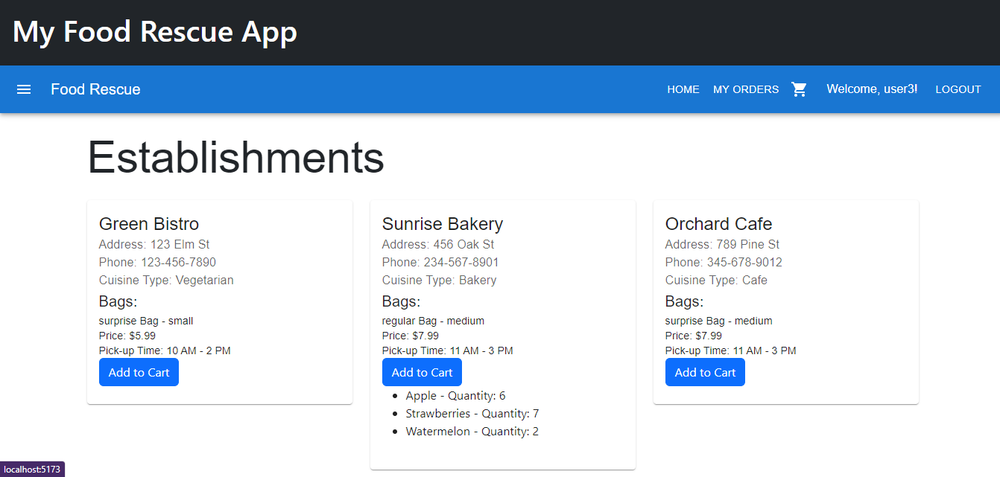
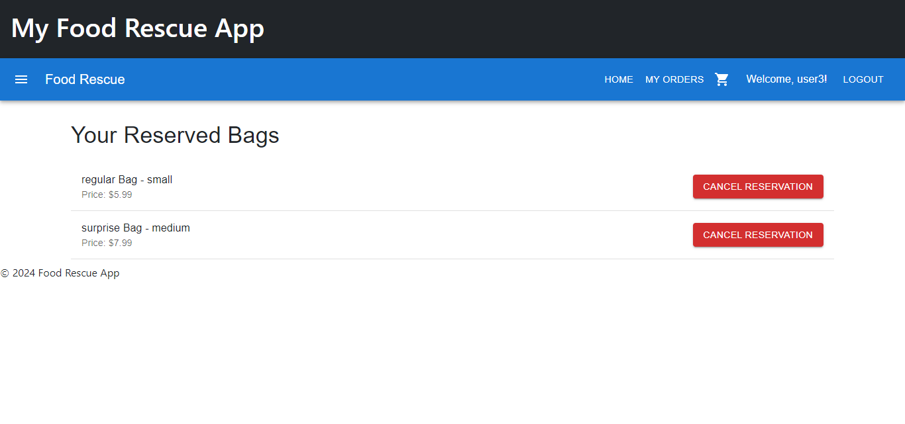

# Exam 4N: "surplus food"
## Student: S317086 Nikjooy Pedram 

## React Client Application Routes

- Route `/` (Establishments List Page):
        Content and Purpose: This page lists various establishments. Users can browse through different establishments, possibly viewing details like location, available bags, and more.
- Route `/login` (Login Page):
        Content and Purpose: This page allows users to log into their accounts. It will typically have a form to enter credentials such as username and password.
- Route `/cart` (Cart Page):
        Content and Purpose: This page displays the items (bags) that the user has added to their shopping cart. Users can review their selected items, adjust quantities, or proceed to checkout.
- Route `/reserved-bags` (Reserved Bags Page):
        Content and Purpose: This page shows the bags that the user has reserved. It provides functionalities such as viewing more details about each reserved bag or canceling the reservation.
## API Server

- `POST /api/users/login`

    - Request Parameters: None
    - Request Body Content: { username: String, password: String }
    - Response Body Content: { success: Boolean, token: String (if success), message: String }

- `GET /api/establishments`

  - Request Parameters: None (or optional filters)
  - Response Body Content: { establishments: Array of { id, name, address, phone, cuisine_type, bags (Array) } }

- `POST /api/cart/add`

  - Request Parameters: None
  - Request Body Content: { userId: Integer, bagId: Integer }
  - Response Body Content: { success: Boolean, message: String }

- `POST /api/cart/remove`

  - Request Parameters: None
  - Request Body Content: { userId: Integer, bagId: Integer }
  - Response Body Content: { success: Boolean, message: String }

- `POST /api/cart/confirm`

  - Request Parameters: None
  - Request Body Content: { userId: Integer }
  - Response Body Content: { success: Boolean, message: String }

- `GET /api/cart/reserved/:userId`

  - Request Parameters: userId (path parameter)
  - Response Body Content: { reservedBags: Array of bags }

- `POST /api/cart/cancel-reservation`

  - Request Parameters: None
  - Request Body Content: { userId: Integer, bagId: Integer }
  - Response Body Content: { success: Boolean, message: String }

- `GET /api/cart/carts/:userId`

  - Request Parameters: userId (path parameter)
  - Response Body Content: { cartItems: Array of { bag details, food items } }

- `POST /api/cart/update-item`

  - Request Parameters: None
  - Request Body Content: { userId: Integer, bagId: Integer, itemId: Integer, newQuantity: Integer }
  - Response Body Content: { success: Boolean, message: String }

## Database Tables

- Table `users` - contains id username password email
- Table `establishments` - contains id name address phone cuisine_type
- Table `bags` - contains id type size price establishment_id available_time reserved
- Table `food_items` - contains id name quantity 
- Table `carts` - contains id user_id bag_id 
- Table `bag_food_item` - contains bag_id food_item_id  
- Table `reservations` - contains user_id bag_id 

## Main React Components

- `EstablishmentsList` (in `EstablishmentsList .jsx`): Purpose: Displays a list of food establishments.
    Functionality: Fetches and shows establishments from the API, each with their details and associated food bags. Offers a button to add food bags to the user's cart.
- `CartButton` (in `CartButton .jsx`): Purpose: Provides a button to add food bags to the cart.
    Functionality: On click, it adds a specified bag to the user's cart and updates the cart's state.
- `CartPage` (in `CartPage.jsx`): Purpose: Manages and displays the user's shopping cart.
    Functionality: Allows users to view, update quantities, remove items from their cart, and proceed to checkout (reserve bags).
- `Login` (in `Login.jsx`): Purpose: Handles user login.
    Functionality: Provides a form for user authentication. On successful login, updates the user context and redirects to the homepage.
- `ReservedBagsPage` (in `ReservedBagsPage.jsx`): Purpose: Displays the bags reserved by the user.
    Functionality: Fetches and shows the list of bags that the user has reserved. Offers a button to cancel reservations.

(only _main_ components, minor ones may be skipped)

## Screenshot

## Users Credentials

- username: user1, password: pssword1 
- username: user2, password: pssword2 
- username: user3, password: pssword3 

